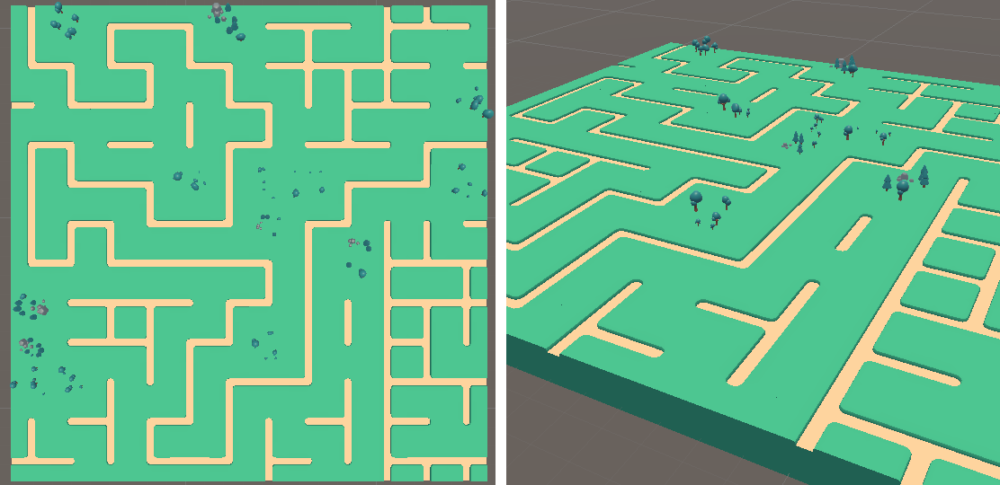
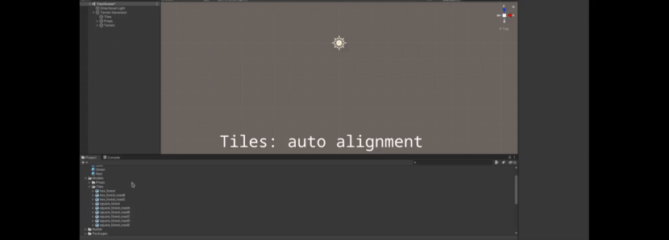

# wade

**Wa**ve-function-collapse **de**mo is a Unity project for generating terrain using tiles and constraints with [BorisTheBrave/DeBroglie](https://github.com/BorisTheBrave/DeBroglie) library.

This project is mainly used to discover (again) Unity, C# and NuGet.

## Features

## Tools
* [Unity Engine](https://unity.com/) 2020.3.24f1
* [NuGetForUnity](https://github.com/GlitchEnzo/NuGetForUnity) 3.0.3

## Librairies
* [BorisTheBrave/DeBroglie](https://github.com/BorisTheBrave/DeBroglie) 1.0.0

## Resources

### Meshes
* Thanks to [Kay Lousberg](https://kaylousberg.com/) and his [Medieval Builder Pack](https://kaylousberg.itch.io/kaykit-medieval-builder-pack)